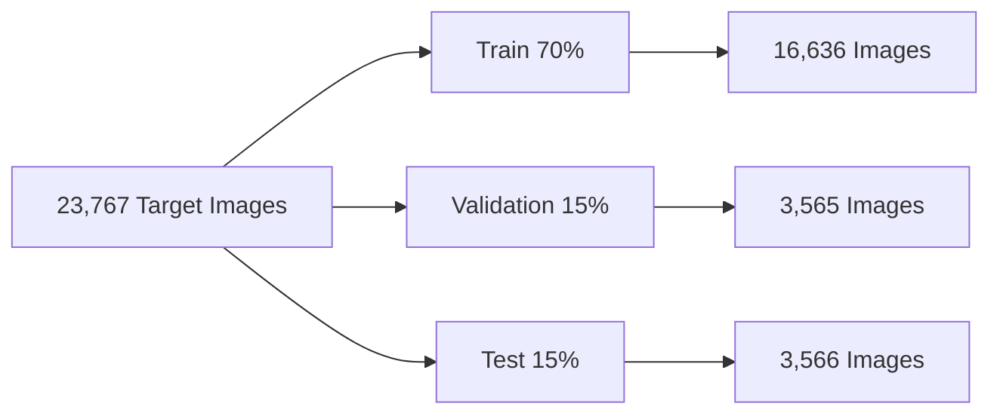
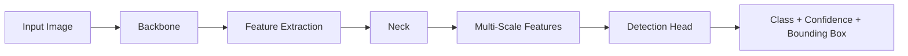
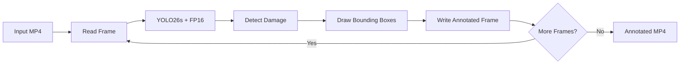
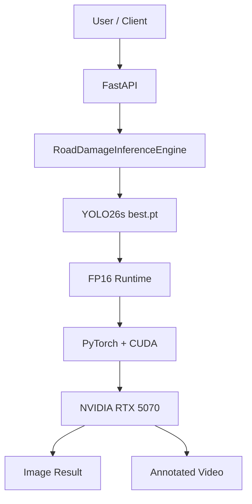

<div align="center">
  
# 🚧 Road Damage Detection

<p align="center">

**End-to-End Computer Vision System for Automated Road Damage Detection**

Detect road damage in images and videos, expose the trained model through a REST API, package the application with Docker, and run GPU-accelerated inference with CUDA and FP16.
<p align="center">
  
</p>

<p align="center">


</p>
</div>

---

## 📌 Project Overview

Road infrastructure inspection is a computer vision problem where the system must locate visible road defects and identify their damage type.

This project builds a complete road damage detection pipeline using **RDD2022** and **Ultralytics YOLO26s**. The work goes beyond training a detector: the final system includes dataset engineering, model evaluation, error analysis, runtime optimization, a reusable inference engine, FastAPI serving, Docker packaging, NVIDIA GPU execution, and image/video prediction endpoints.

The production application accepts an image or video, runs the trained detector, draws bounding boxes around detected road damage, and returns structured results. For video inference, the processed MP4 can also be viewed in the browser or downloaded to the host machine.

The RDD2022 dataset contains road images from six countries and includes four road-damage categories: longitudinal cracks, transverse cracks, alligator cracks, and potholes. The published dataset contains 47,420 road images and more than 55,000 damage instances.  
Sources: [RDD2022 paper](https://doi.org/10.48550/arXiv.2209.08538), [RDD2022 data repository](https://doi.org/10.6084/m9.figshare.21431547.v1).

---

# 🧠 What This Project Demonstrates

This project demonstrates the complete AI engineering lifecycle:

```text
Raw Data
   ↓
Data Audit
   ↓
Annotation Cleaning
   ↓
Target Taxonomy Mapping
   ↓
YOLO Dataset Construction
   ↓
Reproducible Data Split
   ↓
YOLO26s Training
   ↓
Evaluation
   ↓
Error Analysis
   ↓
Runtime Optimization
   ↓
Production Inference Engine
   ↓
FastAPI
   ↓
Docker
   ↓
CUDA / NVIDIA GPU
   ↓
Image + Video API
```

The emphasis is not only on model accuracy, but also on **reproducibility, reliability, latency, deployment, and production usability**.

---

# 🎯 Problem Definition

## Objective

Build a real-time-capable object detection system that identifies visible road damage and localizes each defect using bounding boxes.

## Detection Classes

| ID | Class | Original RDD2022 Label |
|---:|---|---|
| 0 | `longitudinal_crack` | D00 |
| 1 | `transverse_crack` | D10 |
| 2 | `alligator_crack` | D20 |
| 3 | `pothole` | D40 |

The final project focuses on these four target classes.

---

# 🗂️ Dataset

## RDD2022

RDD2022 is a multinational road-damage image dataset released through the Crowdsensing-based Road Damage Detection Challenge (CRDDC'2022).

The official dataset includes data from:

- Japan
- India
- Czech Republic
- Norway
- United States
- China

The official challenge documentation identifies the four target damage categories used here as D00, D10, D20, and D40.  
Source: [CRDDC'2022 Data](https://crddc2022.sekilab.global/data/).

## Official Dataset Scale

| Dataset Property | Official Dataset |
|---|---:|
| Road images | 47,420 |
| Countries | 6 |
| Damage categories used in CRDDC'2022 | 4 |
| Damage instances | 55,000+ |

Source: [RDD2022 dataset paper](https://doi.org/10.1002/gdj3.260).

---

# 🔍 Dataset Audit and Engineering

The raw dataset was not used blindly. A complete audit was performed before model training.

## Audit Results

| Check | Result |
|---|---:|
| XML files parsed | **38,385** |
| Object-level annotations extracted | **65,712** |
| Unique annotated images | **26,661** |
| Target-filtered images | **23,767** |
| Invalid raw bounding boxes | **1** |
| Missing annotated images | **0** |
| Corrupted/unreadable annotated images | **0** |

The raw annotations contained additional categories and one invalid annotation. The project filtered the data to the four target road-damage classes.

## Final Target Dataset

| Class | Final Annotation Count |
|---|---:|
| `longitudinal_crack` | **26,016** |
| `transverse_crack` | **11,830** |
| `alligator_crack` | **10,616** |
| `pothole` | **6,544** |
| **Total** | **55,006** |

---

# 🔄 Reproducible Train / Validation / Test Split

A deterministic image-level split was created to prevent leakage across datasets.



## Split Results

| Split | Images |
|---|---:|
| Train | **16,636** |
| Validation | **3,565** |
| Test | **3,566** |

Split overlap was verified as **zero**.

---

# 🏷️ Annotation Conversion

The original annotations were provided in Pascal VOC XML format.

The pipeline converted:

```text
Pascal VOC
     ↓
Bounding Box Validation
     ↓
Class Mapping
     ↓
YOLO Normalized Coordinates
     ↓
.txt Annotation Files
```

A representative Pascal VOC → YOLO conversion was manually verified.

Example:

```text
Image: China_Drone_000000.jpg
Class: D10

VOC:
xmin = 323
ymin = 213
xmax = 390
ymax = 245

YOLO:
x_center = 0.696289
y_center = 0.447266
width     = 0.130859
height    = 0.062500
```

The final converted dataset contained:

- **55,006** YOLO annotations
- **0** invalid annotation rows
- **0** invalid class IDs
- **0** invalid normalized coordinates
- **0** empty label files
- **0** missing final images

---

# 🏗️ Model Development

## Why YOLO26s?

The project selected **YOLO26s** as the baseline/production model family because the task requires object detection with practical inference performance and deployment considerations.

The selection was treated as an engineering baseline rather than a claim that the architecture is universally optimal for the dataset.

Ultralytics documents YOLO26 as its current released model family, with detection variants ranging from nano through extra-large and support for training, validation, inference, and export.  
Source: [Ultralytics YOLO26 documentation](https://docs.ultralytics.com/models/yolo26).

## Model Concept

At a high level, a YOLO detector performs:



Ultralytics describes the YOLO architecture using the standard backbone → neck → head structure for feature extraction, feature fusion, and prediction.  
Source: [Ultralytics YOLO Architecture](https://docs.ultralytics.com/guides/yolo-architecture).

---

# ⚙️ Training Environment

The local training environment used:

| Component | Value |
|---|---|
| OS | Windows 11 |
| Python | **3.13.0** |
| PyTorch | **2.12.0+cu130** |
| CUDA available | **True** |
| GPU | **NVIDIA GeForce RTX 5070 Laptop GPU** |
| GPU memory | ~**8 GB** |

The model training checkpoint was preserved and reused for production.

---

# 📊 Model Evaluation

The selected production checkpoint was evaluated on the fixed test set.

| Metric | Result |
|---|---:|
| Precision | **0.6449** |
| Recall | **0.5703** |
| mAP@50 | **0.6068** |
| mAP@50-95 | **0.3129** |

These numbers are the measured results for this project's test set and configuration.

---

# 🧪 Error Analysis

The project included dedicated error analysis rather than stopping at the validation metrics.

The analysis covered:

- Confidence threshold / F1 behavior
- Missed detections
- Small-object behavior
- High-confidence false positives
- Visual root-cause analysis
- Targeted improvement experimentation
- Final model comparison

This step was used to understand **where and why the model fails**, not only how many predictions it gets correct.

---

# 🚀 Production Inference

After model development, the project moved from notebook experimentation to reusable inference.

## Inference Configuration

```text
Image Size          = 640
Confidence          = 0.25
Maximum Detections  = 300
Device              = CUDA:0
Runtime              = FP16
```

## Image Inference

The reusable inference layer returns structured information including:

```text
image
image_size
detection_count
class_id
class_name
confidence
bbox
runtime
```

## Batch Inference

Controlled batch validation:

| Measure | Result |
|---|---:|
| Images processed | **10** |
| Images with detections | **10** |
| Images without detections | **0** |
| Total detections | **20** |
| Average detections/image | **2.0** |

---

# 🎥 Video Inference

The project includes frame-by-frame video inference.



## Validated Video Benchmark

| Property | Result |
|---|---:|
| Resolution | **768 × 432** |
| FPS | **23.98** |
| Frames | **155** |
| Duration | **6.46 s** |
| Total detections | **176** |
| Processing time | **4.57 s** |

The output preserved the input video's:

- Resolution
- Frame rate
- Frame count

---

# ⚡ Runtime Optimization

The model checkpoint remained unchanged while runtime precision was evaluated.

## FP32 vs FP16

| Metric | FP32 | FP16 |
|---|---:|---:|
| Average latency | 29.2 ms | **22.75 ms** |
| Median latency | 27.9 ms | **21.95 ms** |
| Minimum latency | 15.0 ms | **15.98 ms** |
| Maximum latency | 50.6 ms | **36.77 ms** |
| Throughput | 34.20 img/s | **43.95 img/s** |

The FP16 runtime was then validated for prediction consistency.

## Prediction Consistency

30 identical benchmark images were compared between FP32 and FP16:

| Consistency Measure | Result |
|---|---:|
| Detection count agreement | **100.00%** |
| Class agreement | **100.00%** |
| Mean confidence difference | **0.001005** |
| Mean bounding-box IoU | **0.9950** |
| Matched detections | **44** |

FP16 was selected as the production runtime configuration.

---

# 🔁 ONNX Experiment

An ONNX export was also performed:

```text
runs/detect/runs/road_damage/yolo26s_rdd2022_baseline/weights/best.onnx
```

The available ONNX smoke test completed successfully, but execution used the **CPUExecutionProvider** rather than a validated GPU provider.

Therefore, ONNX was evaluated as an experiment and was not selected as the production runtime.

---

# 🧩 Production Inference Engine

A reusable:

```text
RoadDamageInferenceEngine
```

was implemented to separate model inference logic from the API layer.

The production engine centralizes:

- Model loading
- Inference configuration
- Image-size configuration
- Confidence threshold
- Detection limit
- Device selection
- FP16 execution

This separation allows the same inference layer to be reused by notebook tests and the production API.

---

# 🌐 FastAPI Application

The production API is implemented in:

```text
app/main.py
```

## API Architecture

```mermaid
flowchart TD
    A[Client] --> B[FastAPI]
    B --> C{Input Type}
    C -->|Image| D[Image Prediction]
    C -->|Video| E[Frame-by-Frame Video Prediction]
    D --> F[RoadDamageInferenceEngine]
    E --> F
    F --> G[YOLO26s FP16]
    G --> H[RTX 5070 GPU]
    D --> I[JSON Response]
    E --> J[Annotated MP4]
    J --> K[/video]
    J --> L[/watch]
    J --> M[/download]
```

## Endpoints

| Method | Endpoint | Purpose |
|---|---|---|
| GET | `/health` | Production health check |
| POST | `/predict` | Image or video prediction |
| POST | `/predict-video` | Direct annotated video response |
| GET | `/video/{filename}` | Stream annotated video |
| GET | `/download/{filename}` | Download annotated video |
| GET | `/watch/{filename}` | Browser video player |

---

# ❤️ Health Check

The production health endpoint returned:

```json
{
  "status": "healthy",
  "model_loaded": true,
  "runtime": "FP16",
  "device": 0
}
```

Validation result:

```text
HTTP 200 OK
```

---

# 📤 Image Prediction API

Example:

```text
POST /predict
Content-Type: multipart/form-data
```

The endpoint accepts an image and returns structured prediction information.

Typical response structure:

```json
{
  "image": "example.jpg",
  "image_size": [512, 512],
  "detection_count": 2,
  "detections": [
    {
      "class_id": 1,
      "class_name": "transverse_crack",
      "confidence": 0.4047,
      "bbox": {
        "x1": 100.0,
        "y1": 120.0,
        "x2": 300.0,
        "y2": 180.0
      }
    }
  ],
  "runtime": "FP16"
}
```

---

# 🎬 Video Prediction API

The final API also supports direct video upload.

Example flow:

```text
Upload road_damage_demo.mp4
        ↓
POST /predict-video
        ↓
Read every frame
        ↓
Run YOLO26s + FP16
        ↓
Draw detected road damage
        ↓
Write annotated MP4
        ↓
Return processed video
```

The resulting video contains the detected road damage overlaid on the original frames.

The production UI also provides:

- ▶️ Browser playback through `/watch/{filename}`
- 🎬 Direct video access through `/video/{filename}`
- ⬇️ Download through `/download/{filename}`

---

# 🐳 Docker Deployment

The application was packaged as:

```text
road-damage-detection:latest
```

## Production Container Stack

```text
Docker
  └── NVIDIA CUDA Runtime
        ├── Python 3.12
        ├── PyTorch 2.13.0
        ├── TorchVision 0.28.0
        ├── Ultralytics 8.4.161
        ├── FastAPI 0.136.1
        └── Uvicorn 0.47.0
```

The Docker image was successfully built from a clean environment.

Approximate image content size:

**5.1 GB**

---

# 🟢 GPU-Enabled Container

The production container was executed with:

```bash
docker run --rm --gpus all -p 8000:8000 road-damage-detection:latest
```

GPU access was successfully validated.

```text
GPU:
NVIDIA GeForce RTX 5070 Laptop GPU

NVIDIA Driver:
592.27

CUDA capability reported by nvidia-smi:
13.1
```

---

# 🔬 PyTorch CUDA Validation Inside Docker

The running container was tested directly with PyTorch.

Result:

```text
CUDA available: True
GPU: NVIDIA GeForce RTX 5070 Laptop GPU
PyTorch CUDA: 13.0
```

This confirmed that the production container has actual PyTorch CUDA access to the NVIDIA GPU.

---

# 🏭 Production Architecture



---

# 📁 Project Structure

```text
Road Damage Detection/
│
├── .vscode/
│
├── notebook/
│   └── Road-Damage-Detection.ipynb
│
├── artifacts/
│   ├── metrics/
│   ├── models/
│   ├── predictions/
│   └── reports/
│
├── assets/
│
├── data/
│   ├── processed/
│   ├── RDD2022/
│   ├── splits/
│   ├── video/
│   └── yolo_dataset/
│
├── app/
│   ├── __init__.py
│   ├── exceptions.py
│   ├── main.py
│   ├── predictor.py
│   ├── schemas.py
│   └── services/
│
├── inference/
│   ├── __init__.py
│   ├── config.py
│   └── engine.py
│
├── models/
│   └── yolov26s_rdd2022/
│       └── best.pt
│
├── outputs/
│   ├── image/
│   └── video/
│
├── runtime/
│   └── uploads/
│
├── src/
│
├── tests/
│   └── __init__.py
│
├── Dockerfile
├── LICENSE
├── README.md
├── requirements.txt
└── .gitignore
```

> Some directories such as `artifacts/`, `src/`, and `tests/` are project scaffolding or organizational locations and may contain only selected artifacts depending on the final cleanup state.

---

# 📦 Core Production Artifacts

The most important production files are:

```text
models/yolov26s_rdd2022/best.pt
inference/config.py
inference/engine.py
app/main.py
requirements.txt
Dockerfile
README.md
```

## Production Model

```text
models/yolov26s_rdd2022/best.pt
```

Validated size:

**19.42 MB**

---

# 🧪 Validation Matrix

| Area | Result |
|---|---|
| Dataset audit | ✅ PASSED |
| Annotation validation | ✅ PASSED |
| VOC → YOLO conversion | ✅ PASSED |
| Reproducible split | ✅ PASSED |
| YOLO26s training | ✅ COMPLETED |
| Model evaluation | ✅ COMPLETED |
| Error analysis | ✅ COMPLETED |
| Production checkpoint | ✅ LOCKED |
| FP16 runtime | ✅ PASSED |
| FP32 vs FP16 consistency | ✅ PASSED |
| Production inference engine | ✅ PASSED |
| FastAPI startup | ✅ PASSED |
| `/health` | ✅ 200 OK |
| `/predict` | ✅ 200 OK |
| `/predict-video` | ✅ PASSED |
| Annotated video generation | ✅ PASSED |
| Docker image build | ✅ PASSED |
| Docker container startup | ✅ PASSED |
| NVIDIA GPU passthrough | ✅ PASSED |
| PyTorch CUDA inside container | ✅ PASSED |
| End-to-end production validation | ✅ PASSED |

---

# 📈 Key Numbers at a Glance

| Category | Result |
|---|---:|
| Raw XML files parsed | **38,385** |
| Raw object annotations | **65,712** |
| Target-filtered images | **23,767** |
| Final YOLO annotations | **55,006** |
| Train images | **16,636** |
| Validation images | **3,565** |
| Test images | **3,566** |
| Precision | **0.6449** |
| Recall | **0.5703** |
| mAP@50 | **0.6068** |
| mAP@50-95 | **0.3129** |
| FP32 throughput | **34.20 img/s** |
| FP16 throughput | **43.95 img/s** |
| FP32 average latency | **29.2 ms** |
| FP16 average latency | **22.75 ms** |
| FP16 detection-count agreement | **100%** |
| FP16 class agreement | **100%** |
| Mean FP16 bbox IoU | **0.9950** |
| GPU | **RTX 5070 Laptop GPU** |
| Production runtime | **FP16 / CUDA:0** |

---

# ▶️ Quick Start

## 1. Clone the repository

```bash
git clone <YOUR_GITHUB_REPOSITORY_URL>
cd "Road Damage Detection"
```

## 2. Install application dependencies

```bash
pip install -r requirements.txt
```

For a specific CUDA/PyTorch setup, install the compatible PyTorch build first, then install the application dependencies. Ultralytics documents this installation pattern and its Python/CLI workflows.  
Source: [Ultralytics Quickstart](https://docs.ultralytics.com/quickstart).

## 3. Start the API locally

```bash
uvicorn app.main:app --host 0.0.0.0 --port 8000
```

Open:

```text
http://localhost:8000/docs
```

## 4. Run with Docker + NVIDIA GPU

```bash
docker build -t road-damage-detection:latest .
```

Then:

```bash
docker run --rm --gpus all -p 8000:8000 road-damage-detection:latest
```

Open:

```text
http://localhost:8000/docs
```

---

# 🧭 API Usage

## Health

```bash
curl http://localhost:8000/health
```

## Image Prediction

```bash
curl -X POST \
  -F "file=@path/to/image.jpg" \
  http://localhost:8000/predict
```

## Video Prediction

```bash
curl -X POST \
  -F "file=@path/to/video.mp4" \
  http://localhost:8000/predict-video
```

The returned response can be used to open the generated annotated video through:

```text
/watch/{filename}
```

or download it through:

```text
/download/{filename}
```

---

# 🖥️ Swagger / OpenAPI

The application exposes the interactive Swagger UI at:

```text
http://localhost:8000/docs
```

The API provides interactive testing for:

- Health checks
- Image prediction
- Video prediction
- Video retrieval
- Video download
- Browser playback

---

# 🖼️ Visual Demonstration

Recommended repository screenshots:

```text
assets/
├── architecture.png
├── dataset_sample.png
├── annotated_image.png
├── swagger_api.png
└── annotated_video_result.png
```

You can add them to the README with:

```markdown


```

The production video output can also be kept under:

```text
outputs/video/
```

---

# 🧠 Engineering Decisions

## 1. Image-Level Splitting

The dataset was split at the image level to avoid the same image appearing across train, validation, and test sets.

## 2. Target Taxonomy

The project intentionally reduced the full raw annotation taxonomy to the four target road-damage classes required for the final detector.

## 3. Fixed Test Benchmark

The test set and evaluation configuration were kept fixed for the final performance report.

## 4. Runtime Optimization

FP16 was selected only after measuring both speed and prediction consistency.

## 5. Production Separation

The trained checkpoint was separated from the API and runtime layers:

```text
Model
  ↓
Inference Engine
  ↓
API
  ↓
Container
```

This makes the project easier to maintain and extend.

## 6. Docker GPU Runtime

CUDA-enabled Docker execution was validated directly rather than assuming that `device=0` alone implied GPU execution.

---

# 🧱 Production Design Principles

The final implementation follows several practical AI engineering principles:

### Reproducibility

- Deterministic data split
- Explicit class mapping
- Fixed evaluation configuration
- Centralized runtime configuration

### Reliability

- Input validation
- Model checkpoint validation
- API health checks
- Response contract validation
- GPU validation
- End-to-end integration testing

### Performance

- FP16 runtime
- Benchmark-driven optimization
- Latency measurement
- Throughput measurement
- Prediction consistency testing

### Deployment

- FastAPI REST interface
- Docker packaging
- CUDA GPU execution
- Image and video inference
- Annotated video delivery

---

# 🛠️ Technology Stack

| Layer | Technology |
|---|---|
| Language | Python |
| Deep Learning | PyTorch |
| Object Detection | Ultralytics YOLO26s |
| Computer Vision | OpenCV |
| Data Format | Pascal VOC → YOLO |
| API | FastAPI |
| Server | Uvicorn |
| Validation | Custom integration tests |
| Optimization | FP16 |
| Model Export Experiment | ONNX |
| Containerization | Docker |
| GPU | NVIDIA RTX 5070 Laptop GPU |
| CUDA | 13.0 production build |
| Dataset | RDD2022 |

---

# 🔬 Reproducibility Notes

The local notebook environment and the production Docker environment are intentionally separated.

The notebook training environment used:

```text
Python 3.13
PyTorch 2.12.0+cu130
```

The production container uses:

```text
Python 3.12
PyTorch 2.13.0
TorchVision 0.28.0
CUDA 13.0
```

The trained `best.pt` checkpoint is reused across these environments.

---

# 📚 References

## RDD2022

Arya, D., Maeda, H., Ghosh, S. K., Toshniwal, D., Sekimoto, Y., et al.

**RDD2022: A multi-national image dataset for automatic road damage detection.**

- Dataset paper: https://doi.org/10.1002/gdj3.260
- arXiv: https://doi.org/10.48550/arXiv.2209.08538
- FigShare dataset: https://doi.org/10.6084/m9.figshare.21431547.v1
- CRDDC data page: https://crddc2022.sekilab.global/data/

## Ultralytics

- Documentation: https://docs.ultralytics.com/
- YOLO26: https://docs.ultralytics.com/models/yolo26
- Architecture guide: https://docs.ultralytics.com/guides/yolo-architecture
- Quickstart: https://docs.ultralytics.com/quickstart

---

# 📜 License

The project source code is released under the **MIT License**.

The RDD2022 dataset remains subject to its original dataset terms and attribution requirements. The project's MIT license does not relicense third-party data.

See:

```text
LICENSE
```

for the software license.

---

# 👤 Project Author

**Morsy**

Computer Science / AI Engineering Portfolio Project

Focus areas demonstrated:

- Machine Learning
- Deep Learning
- Computer Vision
- Object Detection
- Inference Engineering
- API Development
- Docker
- GPU Deployment

---

# ✅ Final Project Status

## PROJECT COMPLETED

This project is complete as an end-to-end AI engineering application.

```text
DATA
  ↓
MODEL
  ↓
EVALUATION
  ↓
ERROR ANALYSIS
  ↓
OPTIMIZATION
  ↓
INFERENCE ENGINE
  ↓
FASTAPI
  ↓
DOCKER
  ↓
CUDA / NVIDIA GPU
  ↓
IMAGE + VIDEO PRODUCTION API
```

**Day 6 is the final project day. No Day 7 is required.**
